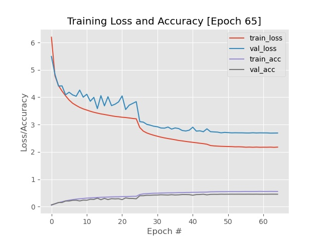

# GoogLeNet-on-Tiny-ImageNet-from-scratch
In this project I tried to implement a GoogLeNet architecture and train it from scratch on the Standford's Tiny ImageNet dataset which is a part of their CNN course challenge.

# Package Requirements
- Python3
- Scikit-Learn
- Numpy
- Progressbar
- H5py
- OpenCV
- Tensorflow 2
- Matplotlib
- Graphviz (If you want to visualize models)

# Instructions on How to run
1) Download the tiny imagenet dataset from <a href='https://tiny-imagenet.herokuapp.com/'>here</a> and unzip it 

2) I converted the dataset into a HDF5 format as it makes it easy to work with huge datasets (highly recommended). To do this simply run the <b>build_dataset</b> script. <b>Make sure to change the configurations(paths and names) in the config/setup_config file and also make a empty hdf5 folder in the tiny imagenet dataset root. All the HDF5 files will be stored there</b>

3) To train the model use the <b>model_train<</b> script. You can resume training from checkpointed model which will be stored in your output folder (this path will be mentioned by you as a command line argument while training). To resume training simply use the -m & -e command line flags and specify the checkpointed model path and the epoch to start from respectively.

4) Evaluate the trained model using the <b>model_eval</b> script. This will display the rank-1 and rank-5 accuracies of the model. 

5) If you wish to visualize the model architecture use <b>view_model</b> script. Remember you need the Graphviz package for it to work.

# Methodology
I implemented the architecture using the standards mentioned in the original paper by Szegedy et al. I trained the model using a manual changing learning rate where I stopped the model when I noticed overfitting, decreased the learning rate by a factor of 10 and resumed training. The exact breakdown is as such Epoch: 1-26 at 1e-3, Epoch 27-40 at 1e-4, Epoch 41-52 at 1e-5 and Epoch 52-60 at 1e-6. After this point I saw no significant development and stopped the training. Finally I recieved a rank-1 and rank-5 accuracy of 29.83% and 56.22% respectively. When compared to the leaderboards given <a href='https://tiny-imagenet.herokuapp.com/'>here</a>, I stand in the top 10. A further possible improvement could be made to the model by dropping some regularizations such as Dropout layers.  
 
# Output
Below is the output of the training plot
 

